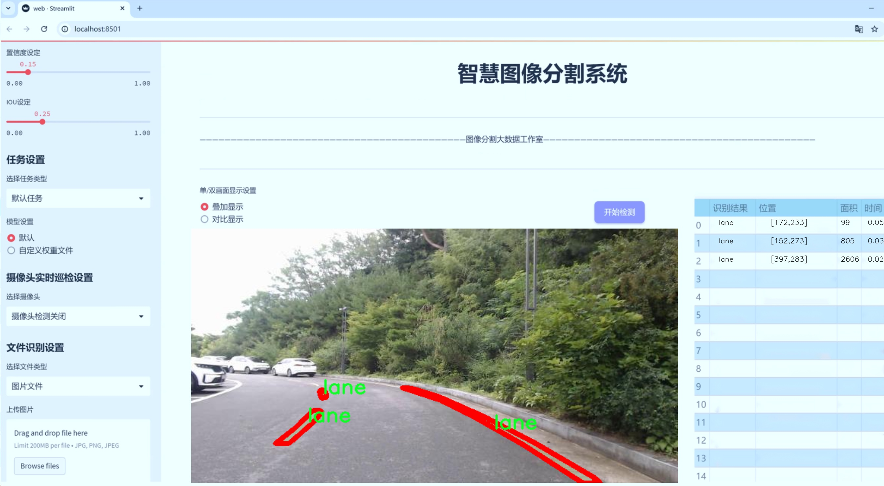
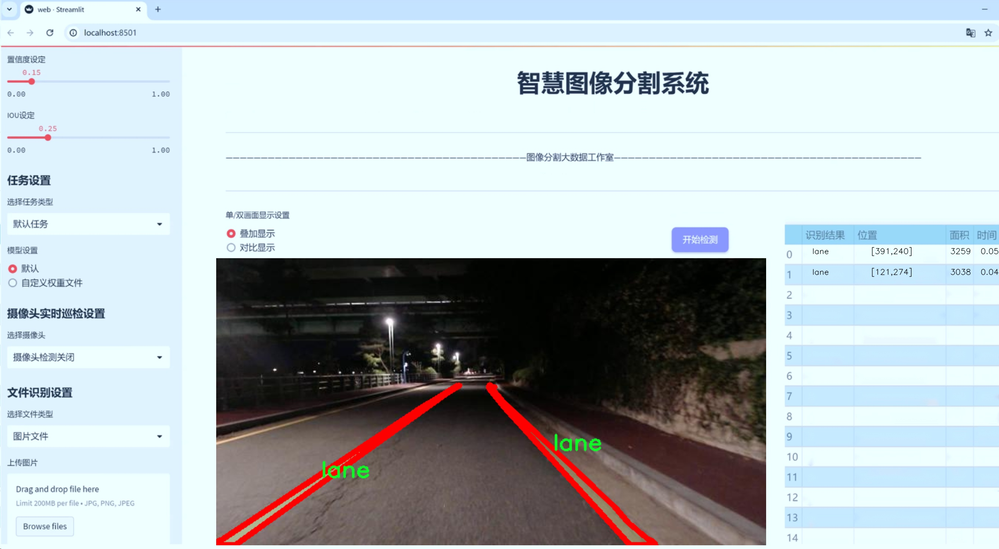

# 交通标线分割系统源码＆数据集分享
 [yolov8-seg-KernelWarehouse＆yolov8-seg-GhostHGNetV2等50+全套改进创新点发刊_一键训练教程_Web前端展示]

### 1.研究背景与意义

项目参考[ILSVRC ImageNet Large Scale Visual Recognition Challenge](https://gitee.com/YOLOv8_YOLOv11_Segmentation_Studio/projects)

项目来源[AAAI Global Al lnnovation Contest](https://kdocs.cn/l/cszuIiCKVNis)

研究背景与意义

随着城市化进程的加快，交通管理面临着前所未有的挑战。交通标线作为道路交通管理的重要组成部分，其清晰度和准确性直接影响到交通安全和行车效率。传统的交通标线检测方法多依赖于人工标注和规则基的方法，存在效率低、准确性差等问题。近年来，深度学习技术的迅猛发展为交通标线的自动化检测与分割提供了新的思路和方法。其中，YOLO（You Only Look Once）系列模型因其高效的实时检测能力而备受关注。YOLOv8作为该系列的最新版本，结合了多种先进的计算机视觉技术，展现出更强的特征提取和处理能力。然而，针对交通标线的特定需求，YOLOv8在实例分割任务中的应用仍有待进一步优化。

本研究旨在基于改进的YOLOv8模型，构建一个高效的交通标线分割系统。该系统将利用一个包含3800张图像的数据集，涵盖四类交通标线：角落、斑马线、车道和停止线。这些类别的多样性不仅反映了城市交通环境的复杂性，也为模型的训练和评估提供了丰富的样本。通过对这些交通标线的精确分割，可以为自动驾驶、智能交通系统以及交通监控提供重要的支持，进而提升道路安全性和行车效率。

在技术层面，改进YOLOv8模型的关键在于如何有效地处理不同类别交通标线的特征。传统的YOLO模型在处理小目标和复杂背景时常常面临挑战，而交通标线往往在图像中占据较小的区域且背景复杂。因此，本研究将针对YOLOv8的网络结构进行改进，引入多尺度特征融合和注意力机制，以增强模型对细小目标的检测能力。此外，数据集中的标注信息将为模型的训练提供坚实的基础，确保其在不同场景下的泛化能力。

从社会意义上看，交通安全问题日益严重，交通事故的频发不仅造成了人员伤亡，还给社会带来了巨大的经济损失。通过开发高效的交通标线分割系统，可以为交通管理部门提供实时的道路状况监测，及时发现和修复交通标线的缺失或模糊，进而降低交通事故的发生率。同时，该系统也为智能交通系统的实现奠定了基础，推动了自动驾驶技术的发展。

综上所述，基于改进YOLOv8的交通标线分割系统的研究不仅具有重要的学术价值，也为实际应用提供了切实可行的解决方案。通过深入探索深度学习在交通标线检测中的应用，我们期待能够为交通管理和智能交通的发展贡献新的思路和方法。

### 2.图片演示






##### 注意：由于此博客编辑较早，上面“2.图片演示”和“3.视频演示”展示的系统图片或者视频可能为老版本，新版本在老版本的基础上升级如下：（实际效果以升级的新版本为准）

  （1）适配了YOLOV8的“目标检测”模型和“实例分割”模型，通过加载相应的权重（.pt）文件即可自适应加载模型。

  （2）支持“图片识别”、“视频识别”、“摄像头实时识别”三种识别模式。

  （3）支持“图片识别”、“视频识别”、“摄像头实时识别”三种识别结果保存导出，解决手动导出（容易卡顿出现爆内存）存在的问题，识别完自动保存结果并导出到tempDir中。

  （4）支持Web前端系统中的标题、背景图等自定义修改，后面提供修改教程。

  另外本项目提供训练的数据集和训练教程,暂不提供权重文件（best.pt）,需要您按照教程进行训练后实现图片演示和Web前端界面演示的效果。

### 3.视频演示

[3.1 视频演示](https://www.bilibili.com/video/BV1GsyBYjEmw/)

### 4.数据集信息展示

##### 4.1 本项目数据集详细数据（类别数＆类别名）

nc: 4
names: ['corner', 'crosswalk', 'lane', 'stop-line']


##### 4.2 本项目数据集信息介绍

数据集信息展示

在交通标线分割的研究领域，数据集的质量和多样性直接影响到模型的训练效果和最终性能。本研究所采用的数据集名为“LANE”，专门用于训练和改进YOLOv8-seg模型，以实现高效的交通标线分割。该数据集包含四个主要类别，分别是“corner”（转角）、“crosswalk”（人行横道）、“lane”（车道）和“stop-line”（停止线）。这些类别的选择不仅涵盖了交通标线的基本元素，还考虑到了城市交通环境的复杂性，为模型的学习提供了丰富的上下文信息。

“LANE”数据集的构建过程经过精心设计，确保了数据的多样性和代表性。每个类别的样本均来自于不同的城市环境和天气条件，涵盖了白天和夜晚、晴天和雨天等多种场景。这种多样性使得模型在面对实际应用时，能够更好地适应不同的环境变化，提升其鲁棒性和准确性。数据集中包含的图像经过精确标注，确保每个交通标线的边界清晰可辨，便于模型进行有效的学习和推理。

在“LANE”数据集中，转角（corner）类别主要用于识别道路转弯处的标线，这对于导航系统和自动驾驶技术至关重要。人行横道（crosswalk）类别则帮助模型识别行人过街的安全区域，确保交通安全。车道（lane）类别则是整个数据集的核心，涵盖了各种类型的车道标线，模型需要通过这些信息来判断车辆的行驶方向和车道变换。最后，停止线（stop-line）类别则是确保车辆在交叉口安全停车的重要标志，这一类别的准确识别对于避免交通事故具有重要意义。

为了提升模型的分割精度和泛化能力，数据集还包含了大量的标注样本，确保每个类别都有足够的训练数据。数据的标注不仅依赖于人工审核，还结合了自动化工具，以提高标注的效率和准确性。此外，数据集的样本也经过了多种数据增强技术的处理，如旋转、缩放、裁剪和颜色变换等，以增加训练过程中的样本多样性，进一步提升模型的学习能力。

在模型训练过程中，采用了先进的深度学习技术，结合YOLOv8-seg的特性，旨在实现对交通标线的实时分割和识别。通过对“LANE”数据集的充分利用，模型能够在复杂的交通场景中进行准确的标线识别，进而为智能交通系统的构建提供有力支持。

总之，“LANE”数据集不仅为交通标线分割提供了丰富的训练样本和类别信息，还通过多样化的场景设置和严格的标注标准，为YOLOv8-seg模型的训练奠定了坚实的基础。随着研究的深入和技术的不断进步，期待该数据集能够为未来的交通管理和自动驾驶技术的发展贡献更多的力量。


### 5.全套项目环境部署视频教程（零基础手把手教学）

[5.1 环境部署教程链接（零基础手把手教学）](https://www.bilibili.com/video/BV1jG4Ve4E9t/?vd_source=bc9aec86d164b67a7004b996143742dc)


[5.2 安装Python虚拟环境创建和依赖库安装视频教程链接（零基础手把手教学）](https://www.bilibili.com/video/BV1nA4VeYEze/?vd_source=bc9aec86d164b67a7004b996143742dc)

### 6.手把手YOLOV8-seg训练视频教程（零基础小白有手就能学会）

[6.1 手把手YOLOV8-seg训练视频教程（零基础小白有手就能学会）](https://www.bilibili.com/video/BV1cA4VeYETe/?vd_source=bc9aec86d164b67a7004b996143742dc)


按照上面的训练视频教程链接加载项目提供的数据集，运行train.py即可开始训练



     Epoch   gpu_mem       box       obj       cls    labels  img_size
     1/200     0G   0.01576   0.01955  0.007536        22      1280: 100%|██████████| 849/849 [14:42<00:00,  1.04s/it]
               Class     Images     Labels          P          R     mAP@.5 mAP@.5:.95: 100%|██████████| 213/213 [01:14<00:00,  2.87it/s]
                 all       3395      17314      0.994      0.957      0.0957      0.0843

     Epoch   gpu_mem       box       obj       cls    labels  img_size
     2/200     0G   0.01578   0.01923  0.007006        22      1280: 100%|██████████| 849/849 [14:44<00:00,  1.04s/it]
               Class     Images     Labels          P          R     mAP@.5 mAP@.5:.95: 100%|██████████| 213/213 [01:12<00:00,  2.95it/s]
                 all       3395      17314      0.996      0.956      0.0957      0.0845

     Epoch   gpu_mem       box       obj       cls    labels  img_size
     3/200     0G   0.01561    0.0191  0.006895        27      1280: 100%|██████████| 849/849 [10:56<00:00,  1.29it/s]
               Class     Images     Labels          P          R     mAP@.5 mAP@.5:.95: 100%|███████   | 187/213 [00:52<00:00,  4.04it/s]
                 all       3395      17314      0.996      0.957      0.0957      0.0845


### 7.50+种全套YOLOV8-seg创新点代码加载调参视频教程（一键加载写好的改进模型的配置文件）

[7.1 50+种全套YOLOV8-seg创新点代码加载调参视频教程（一键加载写好的改进模型的配置文件）](https://www.bilibili.com/video/BV1Hw4VePEXv/?vd_source=bc9aec86d164b67a7004b996143742dc)

### 8.YOLOV8-seg图像分割算法原理

原始YOLOv8-seg算法原理

YOLOv8-seg作为YOLO系列中的最新版本，继承并发展了前几代模型的优点，同时引入了一系列创新，特别是在目标检测和分割任务中的应用。该算法的设计理念围绕着高效性、准确性和灵活性展开，适应了多种场景下的需求，成为了计算机视觉领域的重要工具。

YOLOv8-seg的结构可以分为输入层、主干网络、颈部网络和头部网络四个主要部分。输入层负责接收原始图像，并对其进行缩放处理，以符合模型所需的输入尺寸。这一过程确保了无论输入图像的原始大小如何，模型都能在统一的标准下进行处理，从而提高了模型的适应性和通用性。

主干网络是YOLOv8-seg的核心部分，负责从输入图像中提取有用的特征。该网络采用了一系列卷积操作，通过下采样的方式逐步减少特征图的尺寸，同时增加特征的深度。每个卷积层后面都配备了批归一化和SiLUR激活函数，这不仅加速了模型的收敛速度，还有效防止了梯度消失的问题。主干网络的设计灵感来源于YOLOv7中的E-ELAN结构，特别是引入了C2f模块，该模块通过跨层分支连接来增强模型的梯度流，使得特征提取过程更加高效。C2f模块的设计不仅提升了特征的表达能力，还通过增加残差连接来改善了信息的流动，确保了在轻量化的基础上，模型依然能够获得丰富的梯度信息。

在主干网络的末尾，YOLOv8-seg引入了SPPFl块，该模块通过三个最大池化层的组合，增强了网络对多尺度特征的处理能力。这一设计使得模型能够在面对不同尺寸的目标时，依然保持良好的检测性能。颈部网络则采用了FPNS和PAN结构，旨在融合来自不同尺度的特征图信息。通过这些结构的有效结合，YOLOv8-seg能够在特征融合的过程中，充分利用多层次的信息，从而提升目标检测的准确性。

YOLOv8-seg的头部网络采用了解耦的检测头结构，这一创新设计使得分类和回归任务可以在两个并行的卷积分支中独立进行。这种解耦的方式不仅提高了模型的灵活性，还允许模型在处理复杂场景时，能够更精准地进行目标定位和分类。此外，YOLOv8-seg还将传统的Anchor-Based方法替换为Anchor-Free策略，这一转变简化了模型的设计，减少了对先验框的依赖，使得模型在处理多样化目标时，表现得更加出色。

在训练过程中，YOLOv8-seg引入了一些新的数据增强策略。例如，在训练的最后10个epoch中，关闭了马赛克增强，并采用了动态Task-Aligned Assigner样本分配策略。这些策略的引入旨在提升模型的训练效率和最终的检测性能，使得YOLOv8-seg在面对复杂场景时，依然能够保持高效的学习能力。

损失计算方面，YOLOv8-seg采用了BCELoss作为分类损失，DFLLoss和CIoULoss作为回归损失。这种多样化的损失函数设计，确保了模型在训练过程中能够更好地优化目标检测和分割的性能。通过对分类和回归损失的独立计算，YOLOv8-seg能够在精度和速度之间找到一个良好的平衡点，满足不同应用场景的需求。

YOLOv8-seg不仅在结构上进行了创新，其在性能上的提升也显著。与前几代YOLO模型相比，YOLOv8-seg在推理速度和检测精度上都有了显著的提升。这使得它在实时目标检测和分割任务中，成为了一个极具竞争力的选择。此外，YOLOv8-seg的设计也考虑到了广泛的硬件支持，使得它能够在不同的计算平台上高效运行，进一步扩展了其应用范围。

综上所述，YOLOv8-seg通过对主干网络、颈部网络和头部网络的创新设计，以及在训练过程中的多样化策略，成功地提升了目标检测和分割的性能。其高效性、准确性和灵活性，使得YOLOv8-seg成为了计算机视觉领域中的一项重要技术，广泛应用于智能监控、自动驾驶、医疗影像分析等多个领域。随着YOLOv8-seg的不断发展和完善，未来其在更复杂场景下的应用潜力也将不断被挖掘。


### 9.系统功能展示（检测对象为举例，实际内容以本项目数据集为准）

图9.1.系统支持检测结果表格显示

  图9.2.系统支持置信度和IOU阈值手动调节

  图9.3.系统支持自定义加载权重文件best.pt(需要你通过步骤5中训练获得)

  图9.4.系统支持摄像头实时识别

  图9.5.系统支持图片识别

  图9.6.系统支持视频识别

  图9.7.系统支持识别结果文件自动保存

  图9.8.系统支持Excel导出检测结果数据


### 10.50+种全套YOLOV8-seg创新点原理讲解（非科班也可以轻松写刊发刊，V11版本正在科研待更新）

#### 10.1 由于篇幅限制，每个创新点的具体原理讲解就不一一展开，具体见下列网址中的创新点对应子项目的技术原理博客网址【Blog】：


[10.1 50+种全套YOLOV8-seg创新点原理讲解链接](https://gitee.com/qunmasj/good)

#### 10.2 部分改进模块原理讲解(完整的改进原理见上图和技术博客链接)【如果此小节的图加载失败可以通过CSDN或者Github搜索该博客的标题访问原始博客，原始博客图片显示正常】

### YOLOv8简介
#### Backbone
Darknet-53
53指的是“52层卷积”+output layer。

借鉴了其他算法的这些设计思想

借鉴了VGG的思想，使用了较多的3×3卷积，在每一次池化操作后，将通道数翻倍；

借鉴了network in network的思想，使用全局平均池化（global average pooling）做预测，并把1×1的卷积核置于3×3的卷积核之间，用来压缩特征；（我没找到这一步体现在哪里）


使用了批归一化层稳定模型训练，加速收敛，并且起到正则化作用。

    以上三点为Darknet19借鉴其他模型的点。Darknet53当然是在继承了Darknet19的这些优点的基础上再新增了下面这些优点的。因此列在了这里

借鉴了ResNet的思想，在网络中大量使用了残差连接，因此网络结构可以设计的很深，并且缓解了训练中梯度消失的问题，使得模型更容易收敛。

使用步长为2的卷积层代替池化层实现降采样。（这一点在经典的Darknet-53上是很明显的，output的长和宽从256降到128，再降低到64，一路降低到8，应该是通过步长为2的卷积层实现的；在YOLOv8的卷积层中也有体现，比如图中我标出的这些位置）

#### 特征融合

模型架构图如下

  Darknet-53的特点可以这样概括：（Conv卷积模块+Residual Block残差块）串行叠加4次

  Conv卷积层+Residual Block残差网络就被称为一个stage


上面红色指出的那个，原始的Darknet-53里面有一层 卷积，在YOLOv8里面，把一层卷积移除了

为什么移除呢？

        原始Darknet-53模型中间加的这个卷积层做了什么？滤波器（卷积核）的个数从 上一个卷积层的512个，先增加到1024个卷积核，然后下一层卷积的卷积核的个数又降低到512个

        移除掉这一层以后，少了1024个卷积核，就可以少做1024次卷积运算，同时也少了1024个3×3的卷积核的参数，也就是少了9×1024个参数需要拟合。这样可以大大减少了模型的参数，（相当于做了轻量化吧）

        移除掉这个卷积层，可能是因为作者发现移除掉这个卷积层以后，模型的score有所提升，所以才移除掉的。为什么移除掉以后，分数有所提高呢？可能是因为多了这些参数就容易，参数过多导致模型在训练集删过拟合，但是在测试集上表现很差，最终模型的分数比较低。你移除掉这个卷积层以后，参数减少了，过拟合现象不那么严重了，泛化能力增强了。当然这个是，拿着你做实验的结论，反过来再找补，再去强行解释这种现象的合理性。


通过MMdetection官方绘制册这个图我们可以看到，进来的这张图片经过一个“Feature Pyramid Network(简称FPN)”，然后最后的P3、P4、P5传递给下一层的Neck和Head去做识别任务。 PAN（Path Aggregation Network）


“FPN是自顶向下，将高层的强语义特征传递下来。PAN就是在FPN的后面添加一个自底向上的金字塔，对FPN补充，将低层的强定位特征传递上去，

FPN是自顶（小尺寸，卷积次数多得到的结果，语义信息丰富）向下（大尺寸，卷积次数少得到的结果），将高层的强语义特征传递下来，对整个金字塔进行增强，不过只增强了语义信息，对定位信息没有传递。PAN就是针对这一点，在FPN的后面添加一个自底（卷积次数少，大尺寸）向上（卷积次数多，小尺寸，语义信息丰富）的金字塔，对FPN补充，将低层的强定位特征传递上去，又被称之为“双塔战术”。

FPN层自顶向下传达强语义特征，而特征金字塔则自底向上传达强定位特征，两两联手，从不同的主干层对不同的检测层进行参数聚合,这样的操作确实很皮。
#### 自底向上增强


而 PAN（Path Aggregation Network）是对 FPN 的一种改进，它的设计理念是在 FPN 后面添加一个自底向上的金字塔。PAN 引入了路径聚合的方式，通过将浅层特征图（低分辨率但语义信息较弱）和深层特征图（高分辨率但语义信息丰富）进行聚合，并沿着特定的路径传递特征信息，将低层的强定位特征传递上去。这样的操作能够进一步增强多尺度特征的表达能力，使得 PAN 在目标检测任务中表现更加优秀。


### Gold-YOLO简介
YOLO系列模型面世至今已有8年，由于其优异的性能，已成为目标检测领域的标杆。在系列模型经过十多个不同版本的改进发展逐渐稳定完善的今天，研究人员更多关注于单个计算模块内结构的精细调整，或是head部分和训练方法上的改进。但这并不意味着现有模式已是最优解。

当前YOLO系列模型通常采用类FPN方法进行信息融合，而这一结构在融合跨层信息时存在信息损失的问题。针对这一问题，我们提出了全新的信息聚集-分发（Gather-and-Distribute Mechanism）GD机制，通过在全局视野上对不同层级的特征进行统一的聚集融合并分发注入到不同层级中，构建更加充分高效的信息交互融合机制，并基于GD机制构建了Gold-YOLO。在COCO数据集中，我们的Gold-YOLO超越了现有的YOLO系列，实现了精度-速度曲线上的SOTA。


精度和速度曲线（TensorRT7）


精度和速度曲线（TensorRT8）
传统YOLO的问题
在检测模型中，通常先经过backbone提取得到一系列不同层级的特征，FPN利用了backbone的这一特点，构建了相应的融合结构：不层级的特征包含着不同大小物体的位置信息，虽然这些特征包含的信息不同，但这些特征在相互融合后能够互相弥补彼此缺失的信息，增强每一层级信息的丰富程度，提升网络性能。

原始的FPN结构由于其层层递进的信息融合模式，使得相邻层的信息能够充分融合，但也导致了跨层信息融合存在问题：当跨层的信息进行交互融合时，由于没有直连的交互通路，只能依靠中间层充当“中介”进行融合，导致了一定的信息损失。之前的许多工作中都关注到了这一问题，而解决方案通常是通过添加shortcut增加更多的路径，以增强信息流动。

然而传统的FPN结构即便改进后，由于网络中路径过多，且交互方式不直接，基于FPN思想的信息融合结构仍然存在跨层信息交互困难和信息损失的问题。

#### Gold-YOLO：全新的信息融合交互机制


#### Gold-YOLO架构
参考该博客提出的一种全新的信息交互融合机制：信息聚集-分发机制(Gather-and-Distribute Mechanism)。该机制通过在全局上融合不同层次的特征得到全局信息，并将全局信息注入到不同层级的特征中，实现了高效的信息交互和融合。在不显著增加延迟的情况下GD机制显著增强了Neck部分的信息融合能力，提高了模型对不同大小物体的检测能力。

GD机制通过三个模块实现：信息对齐模块(FAM)、信息融合模块(IFM)和信息注入模块(Inject)。

信息对齐模块负责收集并对齐不同层级不同大小的特征

信息融合模块通过使用卷积或Transformer算子对对齐后的的特征进行融合，得到全局信息

信息注入模块将全局信息注入到不同层级中

在Gold-YOLO中，针对模型需要检测不同大小的物体的需要，并权衡精度和速度，我们构建了两个GD分支对信息进行融合：低层级信息聚集-分发分支(Low-GD)和高层级信息聚集-分发分支(High-GD)，分别基于卷积和transformer提取和融合特征信息。

此外,为了促进局部信息的流动，我们借鉴现有工作，构建了一个轻量级的邻接层融合模块，该模块在局部尺度上结合了邻近层的特征，进一步提升了模型性能。我们还引入并验证了预训练方法对YOLO模型的有效性，通过在ImageNet 1K上使用MAE方法对主干进行预训练，显著提高了模型的收敛速度和精度。


### 11.项目核心源码讲解（再也不用担心看不懂代码逻辑）

#### 11.1 ui.py

以下是经过精简和注释的核心代码部分：

```python
import sys
import subprocess
from QtFusion.path import abs_path

def run_script(script_path):
    """
    使用当前 Python 环境运行指定的脚本。

    Args:
        script_path (str): 要运行的脚本路径
    """
    # 获取当前 Python 解释器的路径
    python_path = sys.executable

    # 构建运行命令，使用 streamlit 运行指定的脚本
    command = f'"{python_path}" -m streamlit run "{script_path}"'

    # 执行命令，并检查返回状态
    result = subprocess.run(command, shell=True)
    if result.returncode != 0:
        print("脚本运行出错。")

# 主程序入口
if __name__ == "__main__":
    # 获取脚本的绝对路径
    script_path = abs_path("web.py")

    # 运行指定的脚本
    run_script(script_path)
```

### 代码详细注释：

1. **导入模块**：
   - `sys`：用于访问与 Python 解释器相关的变量和函数。
   - `subprocess`：用于创建新进程、连接到它们的输入/输出/错误管道，并获得返回码。
   - `abs_path`：从 `QtFusion.path` 模块导入的函数，用于获取文件的绝对路径。

2. **定义 `run_script` 函数**：
   - 该函数接受一个参数 `script_path`，表示要运行的 Python 脚本的路径。
   - 使用 `sys.executable` 获取当前 Python 解释器的路径，以确保使用正确的 Python 环境。
   - 构建一个命令字符串，该命令使用 `streamlit` 模块运行指定的脚本。
   - 使用 `subprocess.run` 执行命令，并通过 `shell=True` 允许在 shell 中执行命令。
   - 检查命令的返回码，如果不为 0，表示脚本运行出错，打印错误信息。

3. **主程序入口**：
   - 使用 `if __name__ == "__main__":` 确保只有在直接运行该脚本时才会执行以下代码。
   - 调用 `abs_path` 函数获取 `web.py` 脚本的绝对路径。
   - 调用 `run_script` 函数运行指定的脚本。

这个程序文件 `ui.py` 的主要功能是通过当前的 Python 环境来运行一个指定的脚本，具体来说是运行一个名为 `web.py` 的脚本。程序的实现过程可以分为几个部分。

首先，文件导入了一些必要的模块，包括 `sys`、`os` 和 `subprocess`。其中，`sys` 模块用于访问与 Python 解释器相关的变量和函数，`os` 模块提供了与操作系统交互的功能，而 `subprocess` 模块则用于创建新进程、连接到它们的输入/输出/错误管道，并获取它们的返回码。

接下来，程序定义了一个名为 `run_script` 的函数，该函数接受一个参数 `script_path`，表示要运行的脚本的路径。在函数内部，首先获取当前 Python 解释器的路径，这通过 `sys.executable` 实现。然后，构建一个命令字符串，使用 `streamlit` 来运行指定的脚本。`streamlit` 是一个用于构建数据应用的框架，命令的格式为 `"{python_path}" -m streamlit run "{script_path}"`。

随后，使用 `subprocess.run` 方法来执行这个命令。`shell=True` 参数表示在 shell 中执行命令。执行后，程序检查返回码，如果返回码不为零，说明脚本运行出错，程序会打印出“脚本运行出错。”的提示信息。

最后，在文件的主程序部分，通过 `if __name__ == "__main__":` 判断当前模块是否是主程序，如果是，则指定要运行的脚本路径为 `web.py`，并调用 `run_script` 函数来执行这个脚本。

总体来说，这个文件的作用是提供一个简单的接口，通过命令行运行一个 Streamlit 应用，方便用户在 Python 环境中启动和调试相关的 web 应用。

#### 11.2 ultralytics\models\nas\model.py

以下是经过简化和注释的核心代码部分：

```python
from pathlib import Path
import torch
from ultralytics.engine.model import Model
from ultralytics.utils.torch_utils import model_info, smart_inference_mode
from .predict import NASPredictor
from .val import NASValidator

class NAS(Model):
    """
    YOLO NAS模型用于目标检测。

    该类提供YOLO-NAS模型的接口，并扩展了Ultralytics引擎中的`Model`类。
    旨在通过预训练或自定义训练的YOLO-NAS模型来简化目标检测任务。
    """

    def __init__(self, model='yolo_nas_s.pt') -> None:
        """初始化NAS模型，使用提供的或默认的'yolo_nas_s.pt'模型。"""
        # 确保提供的模型不是YAML配置文件
        assert Path(model).suffix not in ('.yaml', '.yml'), 'YOLO-NAS模型仅支持预训练模型。'
        super().__init__(model, task='detect')  # 调用父类初始化方法

    @smart_inference_mode()
    def _load(self, weights: str, task: str):
        """加载现有的NAS模型权重，或创建一个新的NAS模型（如果未提供权重，则使用预训练权重）。"""
        import super_gradients
        suffix = Path(weights).suffix
        if suffix == '.pt':
            self.model = torch.load(weights)  # 从.pt文件加载模型
        elif suffix == '':
            self.model = super_gradients.training.models.get(weights, pretrained_weights='coco')  # 获取预训练模型

        # 标准化模型属性
        self.model.fuse = lambda verbose=True: self.model  # 融合模型
        self.model.stride = torch.tensor([32])  # 设置步幅
        self.model.names = dict(enumerate(self.model._class_names))  # 设置类别名称
        self.model.is_fused = lambda: False  # 模型是否已融合
        self.model.yaml = {}  # 用于信息展示
        self.model.pt_path = weights  # 导出时的权重路径
        self.model.task = 'detect'  # 设置任务类型为检测

    def info(self, detailed=False, verbose=True):
        """
        记录模型信息。

        参数:
            detailed (bool): 是否显示模型的详细信息。
            verbose (bool): 控制输出的详细程度。
        """
        return model_info(self.model, detailed=detailed, verbose=verbose, imgsz=640)

    @property
    def task_map(self):
        """返回任务与相应预测器和验证器类的映射字典。"""
        return {'detect': {'predictor': NASPredictor, 'validator': NASValidator}}
```

### 代码注释说明：
1. **类定义**：`NAS`类继承自`Model`类，专门用于YOLO-NAS模型的目标检测。
2. **初始化方法**：`__init__`方法用于初始化模型，确保输入的模型文件不是YAML格式，并调用父类的初始化方法。
3. **加载模型**：`_load`方法负责加载模型权重，支持从.pt文件或通过名称获取预训练模型，并设置模型的相关属性。
4. **模型信息**：`info`方法用于记录和返回模型的详细信息。
5. **任务映射**：`task_map`属性返回一个字典，映射检测任务到相应的预测器和验证器类。

这个程序文件是Ultralytics YOLO-NAS模型的接口实现，主要用于目标检测任务。文件中首先通过文档字符串提供了一个简单的使用示例，展示了如何导入NAS类并使用它进行图像预测。

文件导入了必要的库，包括`Path`用于处理文件路径，`torch`用于深度学习模型的加载和操作，以及Ultralytics引擎中的`Model`类和一些工具函数。接着，定义了一个名为`NAS`的类，它继承自`Model`类，专门用于YOLO-NAS模型的实现。

在`NAS`类的文档字符串中，说明了该类的功能和使用方法，强调了该模型只支持预训练模型，并且不接受YAML配置文件。类的构造函数`__init__`接受一个模型路径参数，默认值为'yolo_nas_s.pt'。在构造函数中，使用断言确保传入的模型路径后缀不是YAML格式，以符合YOLO-NAS模型的要求。

`_load`方法用于加载模型权重。如果提供的权重文件是`.pt`格式，则直接加载该权重；如果没有后缀，则通过`super_gradients`库获取预训练模型。该方法还对模型进行了一些标准化处理，包括设置模型的步幅、类别名称等属性，以便后续使用。

`info`方法用于记录和返回模型的信息，可以选择是否显示详细信息和控制输出的冗长程度。最后，`task_map`属性返回一个字典，将任务映射到相应的预测器和验证器类，方便后续的任务处理。

整体来看，这个文件提供了一个结构清晰、功能明确的YOLO-NAS模型接口，方便用户进行目标检测任务的实现和模型的使用。

#### 11.3 ultralytics\utils\tuner.py

以下是代码中最核心的部分，并附上详细的中文注释：

```python
def run_ray_tune(model,
                 space: dict = None,
                 grace_period: int = 10,
                 gpu_per_trial: int = None,
                 max_samples: int = 10,
                 **train_args):
    """
    使用 Ray Tune 进行超参数调优。

    参数:
        model (YOLO): 要进行调优的模型。
        space (dict, optional): 超参数搜索空间。默认为 None。
        grace_period (int, optional): ASHA 调度器的宽限期（以 epoch 为单位）。默认为 10。
        gpu_per_trial (int, optional): 每个试验分配的 GPU 数量。默认为 None。
        max_samples (int, optional): 要运行的最大试验次数。默认为 10。
        train_args (dict, optional): 传递给 `train()` 方法的额外参数。默认为 {}。

    返回:
        (dict): 包含超参数搜索结果的字典。
    """

    # 如果没有提供超参数搜索空间，则使用默认空间
    if not space:
        space = default_space
        LOGGER.warning('WARNING ⚠️ search space not provided, using default search space.')

    # 获取数据集
    data = train_args.get('data', TASK2DATA[model.task])
    space['data'] = data
    if 'data' not in train_args:
        LOGGER.warning(f'WARNING ⚠️ data not provided, using default "data={data}".')

    # 定义可训练的函数，并分配资源
    trainable_with_resources = tune.with_resources(_tune, {'cpu': NUM_THREADS, 'gpu': gpu_per_trial or 0})

    # 定义 ASHA 调度器用于超参数搜索
    asha_scheduler = ASHAScheduler(time_attr='epoch',
                                   metric=TASK2METRIC[model.task],
                                   mode='max',
                                   max_t=train_args.get('epochs') or DEFAULT_CFG_DICT['epochs'] or 100,
                                   grace_period=grace_period,
                                   reduction_factor=3)

    # 创建 Ray Tune 超参数搜索调优器
    tune_dir = get_save_dir(DEFAULT_CFG, name='tune').resolve()  # 必须是绝对路径
    tune_dir.mkdir(parents=True, exist_ok=True)  # 创建保存调优结果的目录
    tuner = tune.Tuner(trainable_with_resources,
                       param_space=space,
                       tune_config=tune.TuneConfig(scheduler=asha_scheduler, num_samples=max_samples),
                       run_config=RunConfig(callbacks=tuner_callbacks, storage_path=tune_dir))

    # 运行超参数搜索
    tuner.fit()

    # 返回超参数搜索的结果
    return tuner.get_results()
```

### 代码注释说明：

1. **函数定义**：`run_ray_tune` 函数用于使用 Ray Tune 进行超参数调优，接受模型、超参数空间、宽限期、每个试验的 GPU 数量、最大样本数和其他训练参数。

2. **搜索空间**：如果没有提供超参数搜索空间，则使用默认的搜索空间，并发出警告。

3. **数据集**：从训练参数中获取数据集，如果没有提供，则使用默认数据集，并发出警告。

4. **可训练函数**：使用 `tune.with_resources` 定义一个可训练的函数，并为其分配 CPU 和 GPU 资源。

5. **调度器**：定义 ASHA 调度器，用于管理超参数搜索的进程，包括时间属性、评估指标、最大训练时间、宽限期和减少因子。

6. **调优器创建**：创建一个 Ray Tune 的调优器，指定可训练函数、超参数空间、调度器和保存结果的目录。

7. **运行调优**：调用 `tuner.fit()` 开始超参数搜索。

8. **返回结果**：最后返回超参数搜索的结果。

这个程序文件 `ultralytics/utils/tuner.py` 主要用于实现超参数调优，特别是针对 YOLO 模型的训练。它使用了 Ray Tune 这个库来进行超参数的搜索和优化。

首先，文件中导入了一些必要的模块和函数，包括 `subprocess` 用于执行系统命令，`TASK2DATA` 和 `TASK2METRIC` 等配置用于处理不同任务的数据和评估指标，`get_save_dir` 用于获取保存目录等。

`run_ray_tune` 函数是这个文件的核心功能，它接收多个参数来配置超参数调优的过程。主要参数包括模型对象 `model`，超参数搜索空间 `space`，ASHA 调度器的宽限期 `grace_period`，每个试验分配的 GPU 数量 `gpu_per_trial`，最大试验样本数 `max_samples`，以及其他训练参数 `train_args`。

函数首先记录了一条信息，指向 Ray Tune 的文档。接着，它尝试安装 Ray Tune，如果未安装则抛出错误。随后，导入 Ray 相关的模块和类。

接下来，定义了一个默认的超参数搜索空间 `default_space`，其中包含了多种可能的超参数及其取值范围，例如学习率、动量、权重衰减等。这些超参数会影响模型的训练效果。

函数中还定义了一个内部函数 `_tune`，该函数负责使用给定的超参数配置训练 YOLO 模型。它从 Ray 存储中获取模型，并调用 `train` 方法进行训练。

然后，函数检查是否提供了自定义的搜索空间，如果没有，则使用默认的搜索空间。同时，它还获取数据集的信息，并将其添加到搜索空间中。

接下来，使用 `tune.with_resources` 定义了一个可训练的函数，并为其分配了 CPU 和 GPU 资源。然后，定义了 ASHA 调度器，用于管理超参数搜索的过程。

在定义了调度器和回调函数后，创建了一个 Ray Tune 的超参数搜索调优器，并指定了参数空间、调度器、运行配置等。最后，调用 `tuner.fit()` 开始执行超参数搜索，并返回搜索结果。

总体而言，这个文件实现了一个灵活的超参数调优工具，能够帮助用户在训练 YOLO 模型时自动优化多个超参数，以提高模型的性能。

#### 11.4 ultralytics\engine\exporter.py

以下是代码中最核心的部分，并附上详细的中文注释：

```python
class Exporter:
    """
    用于导出模型的类。

    属性:
        args (SimpleNamespace): 导出器的配置。
        callbacks (list, optional): 回调函数列表。默认为 None。
    """

    def __init__(self, cfg=DEFAULT_CFG, overrides=None, _callbacks=None):
        """
        初始化 Exporter 类。

        参数:
            cfg (str, optional): 配置文件的路径。默认为 DEFAULT_CFG。
            overrides (dict, optional): 配置覆盖。默认为 None。
            _callbacks (dict, optional): 回调函数的字典。默认为 None。
        """
        self.args = get_cfg(cfg, overrides)  # 获取配置
        self.callbacks = _callbacks or callbacks.get_default_callbacks()  # 设置回调函数

    @smart_inference_mode()
    def __call__(self, model=None):
        """在运行回调后返回导出文件/目录的列表。"""
        self.run_callbacks('on_export_start')  # 运行导出开始的回调
        t = time.time()  # 记录开始时间
        fmt = self.args.format.lower()  # 将格式转换为小写

        # 选择设备
        self.device = select_device('cpu' if self.args.device is None else self.args.device)

        # 检查模型类名
        model.names = check_class_names(model.names)

        # 检查输入图像大小
        self.imgsz = check_imgsz(self.args.imgsz, stride=model.stride, min_dim=2)

        # 创建输入张量
        im = torch.zeros(self.args.batch, 3, *self.imgsz).to(self.device)

        # 更新模型
        model = deepcopy(model).to(self.device)  # 深拷贝模型并转移到设备
        model.eval()  # 设置为评估模式
        model.float()  # 转换为浮点数
        model = model.fuse()  # 融合模型层

        # 进行干运行以检查模型
        y = None
        for _ in range(2):
            y = model(im)  # 干运行

        # 记录输出形状
        self.output_shape = tuple(y.shape) if isinstance(y, torch.Tensor) else tuple(
            tuple(x.shape if isinstance(x, torch.Tensor) else []) for x in y)

        # 导出模型
        f = [''] * len(export_formats()['Argument'][1:])  # 初始化导出文件名列表
        if 'onnx' in self.args.format:  # 如果格式为 ONNX
            f[0], _ = self.export_onnx()  # 导出 ONNX 模型

        # 完成导出
        f = [str(x) for x in f if x]  # 过滤空值
        self.run_callbacks('on_export_end')  # 运行导出结束的回调
        return f  # 返回导出文件/目录的列表

    @try_export
    def export_onnx(self, prefix=colorstr('ONNX:')):
        """导出 YOLOv8 ONNX 模型。"""
        import onnx  # 导入 ONNX 库

        opset_version = self.args.opset or get_latest_opset()  # 获取 ONNX 操作集版本
        f = str(self.file.with_suffix('.onnx'))  # 设置导出文件名

        # 导出模型到 ONNX 格式
        torch.onnx.export(
            self.model.cpu(),  # 将模型转移到 CPU
            self.im.cpu(),  # 将输入转移到 CPU
            f,
            verbose=False,
            opset_version=opset_version,
            do_constant_folding=True,  # 进行常量折叠
            input_names=['images'],
            output_names=['output0']  # 设置输出名称
        )

        # 检查导出的 ONNX 模型
        model_onnx = onnx.load(f)  # 加载 ONNX 模型
        return f, model_onnx  # 返回导出文件名和模型
```

### 代码核心部分说明：
1. **Exporter 类**：负责模型的导出，包括初始化配置、设备选择、输入检查等。
2. **__call__ 方法**：实现了导出逻辑，运行回调函数，并根据指定格式导出模型。
3. **export_onnx 方法**：专门用于将模型导出为 ONNX 格式，设置了必要的参数和输出名称，并进行了模型的有效性检查。

这些部分是导出 YOLOv8 模型的核心逻辑，确保模型能够正确导出为所需格式。

这个程序文件`ultralytics/engine/exporter.py`主要用于将YOLOv8模型导出为多种格式，以便在不同的深度学习框架和硬件上进行推理。文件中首先列出了支持的导出格式，包括PyTorch、ONNX、TensorFlow等，并提供了每种格式的导出命令和示例。

程序导入了必要的库，包括`json`、`os`、`shutil`、`subprocess`等，以及`torch`和`numpy`等深度学习相关的库。然后定义了一些辅助函数，例如`export_formats`用于返回支持的导出格式，`gd_outputs`用于获取TensorFlow GraphDef模型的输出节点名称，`try_export`是一个装饰器，用于捕获导出过程中的异常并记录日志。

接下来，定义了`Exporter`类，该类负责模型的导出。构造函数中接收配置文件路径和回调函数，并初始化相关参数。`__call__`方法是导出过程的核心，首先运行导出开始的回调，然后根据用户指定的格式进行一系列检查，包括设备选择、模型参数设置等。接着，程序执行模型的干运行，以确保模型可以正常工作。

在导出过程中，程序根据不同的格式调用相应的导出方法，例如`export_torchscript`、`export_onnx`、`export_saved_model`等。每个导出方法中都有具体的实现逻辑，包括使用PyTorch的`torch.jit.trace`进行TorchScript导出，使用ONNX的`torch.onnx.export`进行ONNX导出等。

导出完成后，程序会记录导出结果，并运行导出结束的回调。最后，`Exporter`类还提供了一些用于处理特定格式的导出方法，例如`export_coreml`、`export_tfjs`等，确保模型在不同平台上的兼容性。

整个文件的设计旨在提供一个灵活且易于使用的接口，使得用户能够方便地将YOLOv8模型导出为多种格式，以适应不同的应用场景和需求。

#### 11.5 train.py

以下是代码中最核心的部分，并附上详细的中文注释：

```python
import os
import torch
import yaml
from ultralytics import YOLO  # 导入YOLO模型库

if __name__ == '__main__':  # 确保该模块被直接运行时才执行以下代码
    # 设置训练参数
    workers = 1  # 数据加载的工作进程数
    batch = 8  # 每个批次的样本数量
    device = "0" if torch.cuda.is_available() else "cpu"  # 判断是否使用GPU

    # 获取数据集配置文件的绝对路径
    data_path = abs_path(f'datasets/data/data.yaml', path_type='current')

    # 将路径格式转换为Unix风格
    unix_style_path = data_path.replace(os.sep, '/')
    # 获取数据集目录路径
    directory_path = os.path.dirname(unix_style_path)

    # 读取YAML文件，保持原有顺序
    with open(data_path, 'r') as file:
        data = yaml.load(file, Loader=yaml.FullLoader)

    # 修改数据集路径
    if 'train' in data and 'val' in data and 'test' in data:
        data['train'] = directory_path + '/train'  # 更新训练集路径
        data['val'] = directory_path + '/val'      # 更新验证集路径
        data['test'] = directory_path + '/test'    # 更新测试集路径

        # 将修改后的数据写回YAML文件
        with open(data_path, 'w') as file:
            yaml.safe_dump(data, file, sort_keys=False)

    # 加载YOLO模型配置文件并加载预训练权重
    model = YOLO(r"C:\codeseg\codenew\50+种YOLOv8算法改进源码大全和调试加载训练教程（非必要）\改进YOLOv8模型配置文件\yolov8-seg-C2f-Faster.yaml").load("./weights/yolov8s-seg.pt")

    # 开始训练模型
    results = model.train(
        data=data_path,  # 指定训练数据的配置文件路径
        device=device,  # 指定使用的设备（GPU或CPU）
        workers=workers,  # 指定数据加载的工作进程数
        imgsz=640,  # 指定输入图像的大小为640x640
        epochs=100,  # 指定训练的轮数为100
        batch=batch,  # 指定每个批次的大小为8
    )
```

### 代码注释说明：
1. **导入必要的库**：引入了处理文件路径、深度学习框架（PyTorch）、YAML文件解析和YOLO模型的库。
2. **设置训练参数**：定义了数据加载的工作进程数、批次大小和设备选择（GPU或CPU）。
3. **读取和修改YAML配置文件**：读取数据集的配置文件，更新训练、验证和测试集的路径，并将修改后的内容写回文件。
4. **加载YOLO模型**：根据指定的配置文件加载YOLO模型及其预训练权重。
5. **训练模型**：调用模型的训练方法，传入数据配置、设备、工作进程数、图像大小、训练轮数和批次大小等参数。

该程序文件 `train.py` 是一个用于训练 YOLO（You Only Look Once）模型的脚本。首先，程序导入了必要的库，包括 `os`、`torch`、`yaml` 和 `ultralytics` 中的 YOLO 模型，以及用于处理路径的 `QtFusion.path` 和用于绘图的 `matplotlib`。

在主程序部分，首先设置了一些训练参数，包括工作进程数 `workers` 和批次大小 `batch`。批次大小设置为 8，用户可以根据计算机的显存和内存情况进行调整。如果显存不足，可以降低该值。接着，程序检查是否有可用的 GPU，如果有，则将设备设置为 "0"（表示第一个 GPU），否则使用 CPU。

程序通过 `abs_path` 函数获取数据集配置文件 `data.yaml` 的绝对路径，并将其转换为 UNIX 风格的路径。接下来，程序获取该路径的目录，并打开 YAML 文件以读取数据。读取后，程序检查 YAML 文件中是否包含 'train'、'val' 和 'test' 项，如果存在，则将这些项的路径修改为相应的训练、验证和测试数据集的目录路径。修改完成后，程序将更新后的数据写回 YAML 文件。

在模型加载部分，程序创建了一个 YOLO 模型实例，并加载了指定的配置文件和预训练权重。用户可以根据需要更换不同的模型配置文件。

最后，程序调用 `model.train()` 方法开始训练模型，传入训练数据的配置文件路径、设备、工作进程数、输入图像大小（640x640）、训练的 epoch 数（100）以及批次大小。训练过程将使用这些参数进行模型的训练。

#### 11.6 ultralytics\nn\extra_modules\orepa.py

以下是代码中最核心的部分，并附上详细的中文注释：

```python
import torch
import torch.nn as nn
import torch.nn.functional as F
import numpy as np

# 定义OREPA模块
class OREPA(nn.Module):
    def __init__(self, in_channels, out_channels, kernel_size=3, stride=1, padding=None, groups=1, dilation=1, act=True):
        super(OREPA, self).__init__()
        
        # 初始化参数
        self.in_channels = in_channels
        self.out_channels = out_channels
        self.kernel_size = kernel_size
        self.stride = stride
        self.padding = padding if padding is not None else (kernel_size // 2)
        self.groups = groups
        self.dilation = dilation
        
        # 激活函数
        self.nonlinear = nn.ReLU() if act else nn.Identity()
        
        # 定义权重参数
        self.weight_orepa_origin = nn.Parameter(torch.Tensor(out_channels, in_channels // groups, kernel_size, kernel_size))
        nn.init.kaiming_uniform_(self.weight_orepa_origin)  # 使用Kaiming初始化
        
        # 其他权重参数
        self.weight_orepa_avg_conv = nn.Parameter(torch.Tensor(out_channels, in_channels // groups, 1, 1))
        nn.init.kaiming_uniform_(self.weight_orepa_avg_conv)
        
        self.weight_orepa_1x1 = nn.Parameter(torch.Tensor(out_channels, in_channels // groups, 1, 1))
        nn.init.kaiming_uniform_(self.weight_orepa_1x1)

        # 扩展卷积参数
        expand_ratio = 8
        self.weight_orepa_gconv_dw = nn.Parameter(torch.Tensor(in_channels * expand_ratio, 1, kernel_size, kernel_size))
        nn.init.kaiming_uniform_(self.weight_orepa_gconv_dw)

        self.weight_orepa_gconv_pw = nn.Parameter(torch.Tensor(out_channels, in_channels * expand_ratio // groups, 1, 1))
        nn.init.kaiming_uniform_(self.weight_orepa_gconv_pw)

    def weight_gen(self):
        # 生成最终的卷积权重
        weight_orepa_origin = self.weight_orepa_origin  # 原始卷积权重
        weight_orepa_avg = F.avg_pool2d(self.weight_orepa_avg_conv, kernel_size=(1, 1))  # 平均卷积权重
        weight_orepa_1x1 = self.weight_orepa_1x1  # 1x1卷积权重
        
        # 生成深度可分离卷积权重
        weight_gconv_dw = self.dwsc2full(self.weight_orepa_gconv_dw, self.weight_orepa_gconv_pw, self.groups)
        
        # 返回所有权重的加和
        return weight_orepa_origin + weight_orepa_avg + weight_orepa_1x1 + weight_gconv_dw

    def dwsc2full(self, weight_dw, weight_pw, groups):
        # 将深度卷积和逐点卷积结合
        t, ig, h, w = weight_dw.size()
        o, _, _, _ = weight_pw.size()
        tg = int(t / groups)
        i = int(ig * groups)
        
        weight_dw = weight_dw.view(groups, tg, ig, h, w)
        weight_pw = weight_pw.view(o, groups, tg)
        
        weight_dsc = torch.einsum('gtihw,ogt->ogihw', weight_dw, weight_pw)  # 使用爱因斯坦求和约定
        return weight_dsc.view(o, i, h, w)

    def forward(self, inputs):
        # 前向传播
        weight = self.weight_gen()  # 生成权重
        out = F.conv2d(inputs, weight, stride=self.stride, padding=self.padding, dilation=self.dilation, groups=self.groups)  # 卷积操作
        return self.nonlinear(out)  # 返回经过激活函数处理的输出

# 示例：创建OREPA模块
orepa_layer = OREPA(in_channels=64, out_channels=128)
```

### 代码注释说明：
1. **OREPA类**：这是一个自定义的卷积层，使用了多个不同的卷积方式（如原始卷积、平均卷积、1x1卷积和深度可分离卷积）来生成最终的卷积权重。
2. **初始化方法**：在初始化中定义了输入输出通道、卷积核大小、步幅、填充、分组数、扩张率等参数，并初始化了多个权重参数。
3. **权重生成方法**：`weight_gen`方法负责生成最终的卷积权重，结合了不同类型的卷积权重。
4. **前向传播方法**：`forward`方法执行前向传播，使用生成的权重对输入进行卷积操作，并通过激活函数处理输出。

这个模块的设计使得它能够灵活地处理不同的卷积操作，并在深度学习模型中提高了特征提取的能力。

这个程序文件`orepa.py`实现了一种名为OREPA（Optimized Reparameterization for Efficient Convolution）的深度学习模块，主要用于卷积神经网络中的卷积操作。文件中定义了多个类和函数，主要包括OREPA、OREPA_LargeConv、ConvBN和RepVGGBlock_OREPA等。

首先，文件导入了必要的库，包括PyTorch的核心库、数学库、NumPy以及一些自定义的模块。接着，定义了一些辅助函数，如`transI_fusebn`和`transVI_multiscale`，用于处理卷积核和批归一化的融合，以及多尺度的卷积核填充。

`OREPA`类是该文件的核心部分，继承自`nn.Module`。在其构造函数中，初始化了多个参数，包括输入和输出通道数、卷积核大小、步幅、填充、分组、扩张率等。根据是否处于部署模式，初始化不同的卷积层和参数。该类还实现了权重生成、前向传播、权重转换等功能。权重生成的过程涉及到多个分支的权重组合，利用`torch.einsum`实现高效的张量运算。

`OREPA_LargeConv`类是对大卷积核的处理，支持更大的卷积核并保持高效性。其构造函数中也初始化了多个卷积层，并在前向传播中生成权重并进行卷积操作。

`ConvBN`类则实现了带有批归一化的卷积层，支持在部署模式下直接使用卷积层，而在训练模式下使用卷积和批归一化的组合。

`OREPA_3x3_RepVGG`类是一个特定的实现，主要用于3x3卷积的优化，支持多种卷积分支的组合，并通过权重生成函数生成最终的卷积权重。

最后，`RepVGGBlock_OREPA`类实现了一个包含多个卷积分支的块，支持可选的SE注意力机制。它的前向传播方法结合了不同分支的输出，并通过非线性激活函数进行处理。

整体来看，这个文件的设计旨在通过优化卷积操作和参数重参数化，提升深度学习模型的性能和效率，尤其是在移动设备和边缘计算场景中的应用。

### 12.系统整体结构（节选）

### 整体功能和构架概括

该项目是一个用于目标检测的深度学习框架，主要实现了YOLO（You Only Look Once）系列模型的训练、导出和推理功能。项目的结构清晰，包含多个模块，每个模块负责特定的功能。整体架构包括模型定义、训练流程、超参数调优、模型导出、数据处理和辅助工具等。通过这些模块，用户可以方便地进行模型训练、优化和部署。

### 文件功能整理表

| 文件路径                                           | 功能描述                                                     |
|--------------------------------------------------|----------------------------------------------------------|
| `ui.py`                                         | 提供一个接口来运行Streamlit应用，方便用户进行模型的可视化和交互。 |
| `ultralytics/models/nas/model.py`              | 实现YOLO-NAS模型的定义和加载，支持模型的训练和推理。         |
| `ultralytics/utils/tuner.py`                   | 实现超参数调优功能，使用Ray Tune进行超参数搜索和优化。       |
| `ultralytics/engine/exporter.py`               | 实现模型导出功能，支持将YOLO模型导出为多种格式（如ONNX、TensorFlow等）。 |
| `train.py`                                     | 负责模型的训练过程，包括数据加载、模型初始化和训练循环。     |
| `ultralytics/nn/extra_modules/orepa.py`       | 实现OREPA模块，优化卷积操作，提高模型的效率和性能。         |
| `ultralytics/utils/callbacks/wb.py`           | 提供回调函数，用于在训练过程中记录和监控模型的性能。         |
| `ultralytics/data/base.py`                     | 定义数据集的基本类和接口，支持数据加载和预处理。             |
| `ultralytics/models/rtdetr/model.py`           | 实现RT-DETR模型的定义和加载，支持目标检测任务。              |
| `ultralytics/utils/instance.py`                | 提供实例化工具，用于管理模型和数据的实例化过程。              |
| `ultralytics/utils/files.py`                   | 提供文件操作的工具函数，包括文件读取、写入和路径处理。       |
| `ultralytics/data/dataset.py`                  | 实现数据集类，负责数据的加载、增强和批处理。                 |
| `ultralytics/engine/tuner.py`                  | 实现训练过程中的超参数调优，结合训练和验证过程进行优化。     |

以上表格整理了每个文件的功能，帮助理解项目的整体架构和各个模块的作用。

注意：由于此博客编辑较早，上面“11.项目核心源码讲解（再也不用担心看不懂代码逻辑）”中部分代码可能会优化升级，仅供参考学习，完整“训练源码”、“Web前端界面”和“50+种创新点源码”以“14.完整训练+Web前端界面+50+种创新点源码、数据集获取”的内容为准。

### 13.图片、视频、摄像头图像分割Demo(去除WebUI)代码

在这个博客小节中，我们将讨论如何在不使用WebUI的情况下，实现图像分割模型的使用。本项目代码已经优化整合，方便用户将分割功能嵌入自己的项目中。
核心功能包括图片、视频、摄像头图像的分割，ROI区域的轮廓提取、类别分类、周长计算、面积计算、圆度计算以及颜色提取等。
这些功能提供了良好的二次开发基础。

### 核心代码解读

以下是主要代码片段，我们会为每一块代码进行详细的批注解释：

```python
import random
import cv2
import numpy as np
from PIL import ImageFont, ImageDraw, Image
from hashlib import md5
from model import Web_Detector
from chinese_name_list import Label_list

# 根据名称生成颜色
def generate_color_based_on_name(name):
    ......

# 计算多边形面积
def calculate_polygon_area(points):
    return cv2.contourArea(points.astype(np.float32))

...
# 绘制中文标签
def draw_with_chinese(image, text, position, font_size=20, color=(255, 0, 0)):
    image_pil = Image.fromarray(cv2.cvtColor(image, cv2.COLOR_BGR2RGB))
    draw = ImageDraw.Draw(image_pil)
    font = ImageFont.truetype("simsun.ttc", font_size, encoding="unic")
    draw.text(position, text, font=font, fill=color)
    return cv2.cvtColor(np.array(image_pil), cv2.COLOR_RGB2BGR)

# 动态调整参数
def adjust_parameter(image_size, base_size=1000):
    max_size = max(image_size)
    return max_size / base_size

# 绘制检测结果
def draw_detections(image, info, alpha=0.2):
    name, bbox, conf, cls_id, mask = info['class_name'], info['bbox'], info['score'], info['class_id'], info['mask']
    adjust_param = adjust_parameter(image.shape[:2])
    spacing = int(20 * adjust_param)

    if mask is None:
        x1, y1, x2, y2 = bbox
        aim_frame_area = (x2 - x1) * (y2 - y1)
        cv2.rectangle(image, (x1, y1), (x2, y2), color=(0, 0, 255), thickness=int(3 * adjust_param))
        image = draw_with_chinese(image, name, (x1, y1 - int(30 * adjust_param)), font_size=int(35 * adjust_param))
        y_offset = int(50 * adjust_param)  # 类别名称上方绘制，其下方留出空间
    else:
        mask_points = np.concatenate(mask)
        aim_frame_area = calculate_polygon_area(mask_points)
        mask_color = generate_color_based_on_name(name)
        try:
            overlay = image.copy()
            cv2.fillPoly(overlay, [mask_points.astype(np.int32)], mask_color)
            image = cv2.addWeighted(overlay, 0.3, image, 0.7, 0)
            cv2.drawContours(image, [mask_points.astype(np.int32)], -1, (0, 0, 255), thickness=int(8 * adjust_param))

            # 计算面积、周长、圆度
            area = cv2.contourArea(mask_points.astype(np.int32))
            perimeter = cv2.arcLength(mask_points.astype(np.int32), True)
            ......

            # 计算色彩
            mask = np.zeros(image.shape[:2], dtype=np.uint8)
            cv2.drawContours(mask, [mask_points.astype(np.int32)], -1, 255, -1)
            color_points = cv2.findNonZero(mask)
            ......

            # 绘制类别名称
            x, y = np.min(mask_points, axis=0).astype(int)
            image = draw_with_chinese(image, name, (x, y - int(30 * adjust_param)), font_size=int(35 * adjust_param))
            y_offset = int(50 * adjust_param)

            # 绘制面积、周长、圆度和色彩值
            metrics = [("Area", area), ("Perimeter", perimeter), ("Circularity", circularity), ("Color", color_str)]
            for idx, (metric_name, metric_value) in enumerate(metrics):
                ......

    return image, aim_frame_area

# 处理每帧图像
def process_frame(model, image):
    pre_img = model.preprocess(image)
    pred = model.predict(pre_img)
    det = pred[0] if det is not None and len(det)
    if det:
        det_info = model.postprocess(pred)
        for info in det_info:
            image, _ = draw_detections(image, info)
    return image

if __name__ == "__main__":
    cls_name = Label_list
    model = Web_Detector()
    model.load_model("./weights/yolov8s-seg.pt")

    # 摄像头实时处理
    cap = cv2.VideoCapture(0)
    while cap.isOpened():
        ret, frame = cap.read()
        if not ret:
            break
        ......

    # 图片处理
    image_path = './icon/OIP.jpg'
    image = cv2.imread(image_path)
    if image is not None:
        processed_image = process_frame(model, image)
        ......

    # 视频处理
    video_path = ''  # 输入视频的路径
    cap = cv2.VideoCapture(video_path)
    while cap.isOpened():
        ret, frame = cap.read()
        ......
```


### 14.完整训练+Web前端界面+50+种创新点源码、数据集获取


# [下载链接：https://mbd.pub/o/bread/Zp2amJtx](https://mbd.pub/o/bread/Zp2amJtx)